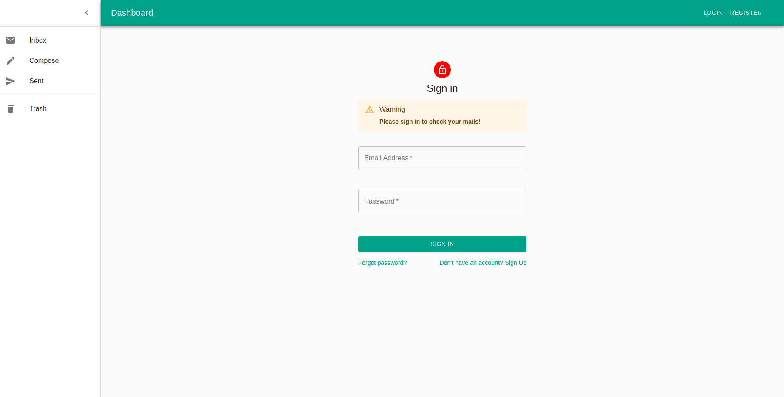
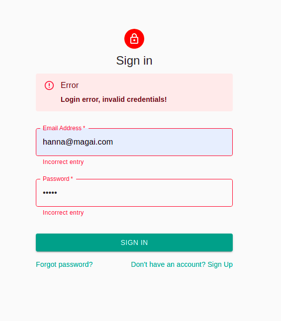
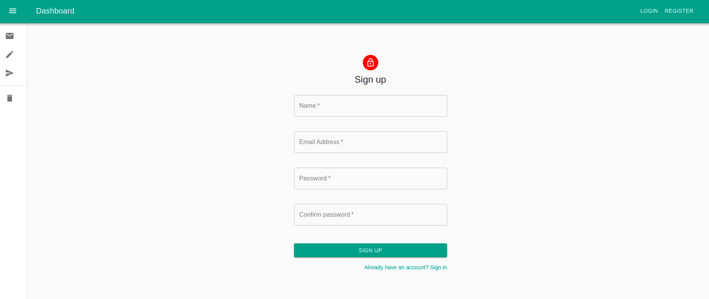
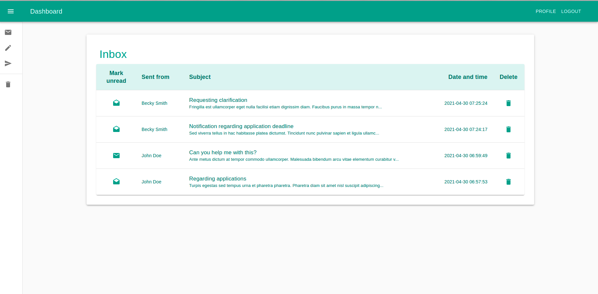
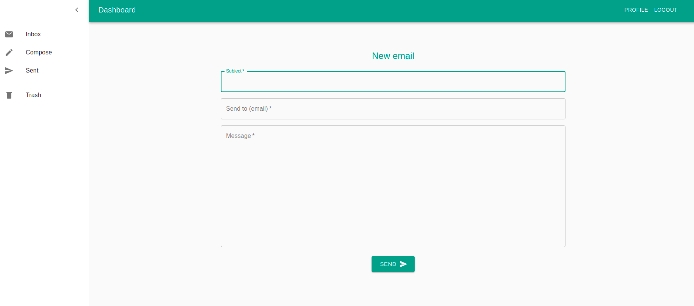
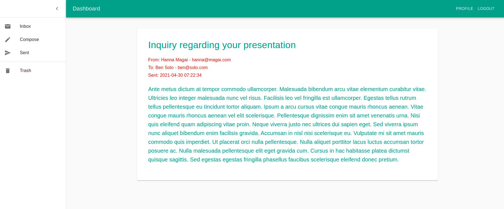

# Get to know Lara

##  About the project

Get to know Lara is a solo project with the aim to get to know the Laravel framework.
The project contains a Laravel backend API and a React frontend in separated directories.
As for its functionality, this is a simple mail application, which makes it possible to send and receive emails between registered users.

### 1. Main features
1. Login / registration
2. Checking inbox
3. Checking sent emails
4. Writing and sending new email
5. Deleting email
6. Checking details of one email
7. Mark read/unread email

### 2. Requirements / installation
- `PHP` 7.3+
- `MySQL` 15.1+
- `Composer` is required for backend Laravel dependencies
- Laravel dependencies can be installed with the `composer install` command
- `Npm` package manager is required for the React frontend
- React dependencies can be installed with the `npm install` command
- Run the project with `npm start` from the frontend folder
- For testing purposes there are 2 seeders available for the `users` and the `mails` DB tables
- Run seeders with the following artisan commands:
  - `php artisan db:seed --class=UsersTableSeeder`
  - `php artisan db:seed --class=MailsTableSeeder`

### 3 Backend API endpoints
 #### 3.1 Login (/login):
- validates input data, if invalid input, sends bad request status and message
- if user input is valid, checks credentials with hashed password
- if credentials are also valid, generates and returns a bearer token for the user
 
  

#### 3.2 Register (/register):
- validates input data, if invalid input, sends bad request status and message
- if user input is valid, creates the user in the DB and returns a registrations successful message
  

#### 3.3 Inbox (/mails/inbox):
- endpoint is authenticated with sanctum, and with protected route on react frontend side
- returns the emails sent to the current user from the DB in descending order by sending time
  

#### 3.4 Sent (/mails/sent):
- endpoint is authenticated with sanctum, and with protected route on react frontend side
- returns the emails sent from the current user from the DB in descending order by sending time

#### 3.5 Write email (/mails/compose):
- endpoint is authenticated with sanctum, and with protected route on react frontend side
- validates input data, if invalid input, sends bad request status and message
- if input is valid, creates and stores email in DB, returns the created Mail object and *created* as status
  

#### 3.6 Delete email (/mails/delete/{id}):
- endpoint is authenticated with sanctum, and with protected route on react frontend side
- checks if user is sender or receiver of the email
- only deletes it on the requested side
- soft deletes only, can be restored if needed
- returns message with http status code for success or failure

#### 3.7 Check email details (/mails/view/{id}):
- endpoint is authenticated with sanctum, and with protected route on react frontend side
- returns Mail object with sender and receiver details and status code
  

#### 3.8 Mark email as read / unread (/mails/mark-as-unread/{id}):
- endpoint is authenticated with sanctum, and with protected route on react frontend side
- updates the selected email status in the DB
- returns the updated Mail object with http status code

#### 3.9 Others:
- **/validate-token**: used by the frontend to validate protected routes
- **/logout**: used to delete session data from the backend during logout
- **/user/{id}**: returns requested user for testing purposes
- **/mails**: returns all emails form the DB for testing purposes
- **/trash**: not implemented yet, will be used to check deleted emails

### 4. Frontend features
- uses Material UI components for design elements
- uses protected routes with bearer token
- uses axios for fetching data from the backend API
- uses React Context for system messages
- implemented simple client side validation for input forms
